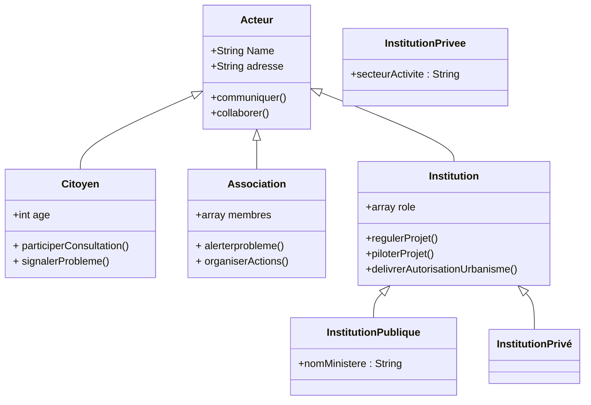

```mermaid
classDiagram
    Acteur <|-- Citoyen
    Acteur <|-- Association
    Acteur <|-- Institution
    Institution <|-- InstitutionPublique
    Institution <|-- InstitutionPrivé
    Acteur : +String Name
    Acteur : +String adresse
    Acteur: +communiquer()
    Acteur: +collaborer()
    class Citoyen{
      +int age
      + participerConsultation()
      + signalerProbleme()
    }
class Institution {
        +array role
        +regulerProjet()
        +piloterProjet()
        +delivrerAutorisationUrbanisme()
    }
    class Association{

    +array membres 
    + alerterprobleme()
    + organiserActions()
    }
     class InstitutionPublique {
      +nomMinistere : String
    }

    class InstitutionPrivee {
      +secteurActivite : String
    }
```
