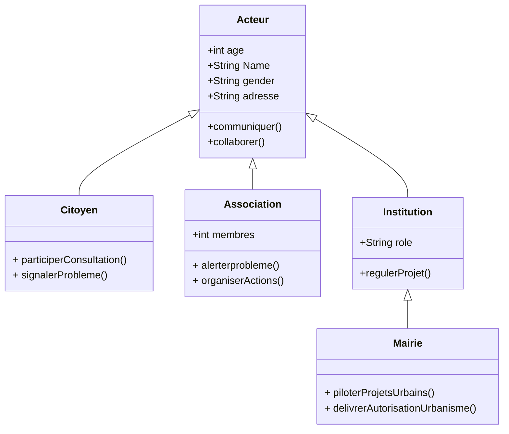

```mermaid
classDiagram
    Acteur <|-- Citoyen
    Acteur <|-- Association
    Acteur <|-- Institution
    Institution <|-- Mairie
    Acteur : +int age
    Acteur : +String Name
    Acteur : +String gender
    Acteur : +String adresse
    Acteur: +communiquer()
    Acteur: +collaborer()
    class Citoyen{
      + participerConsultation()
      + signalerProbleme()
    }
class Institution {
        +String role
        +regulerProjet()
    }
    class Association{

    +int membres 
    + alerterprobleme()
    + organiserActions()
    }
   class Mairie {
    + piloterProjetsUrbains()
    + delivrerAutorisationUrbanisme()
}
```
