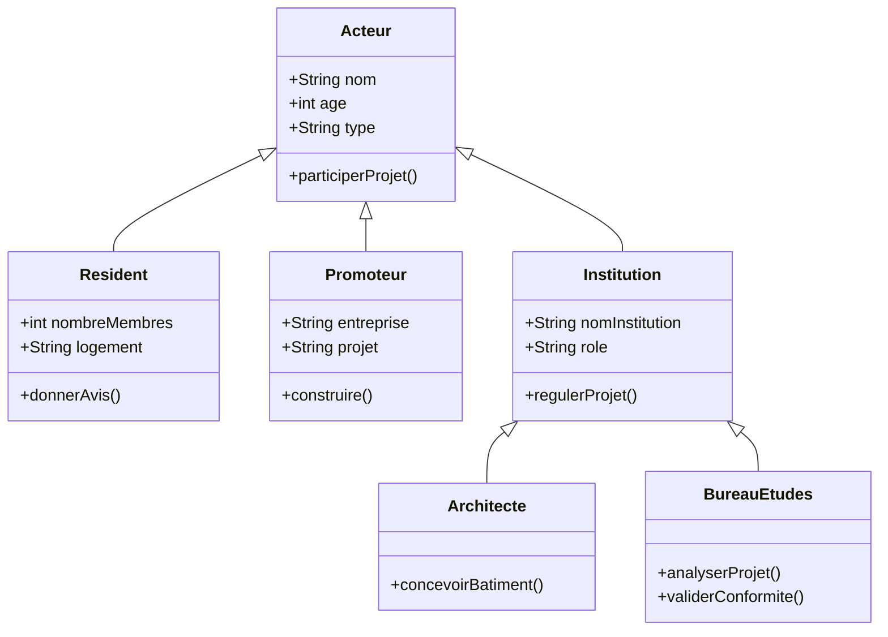

```mermaid

classDiagram
      
       class Acteur {
           +String nom
           +int age
           +String type
           +participerProjet()
       }

       
       Acteur <|-- Resident
       Acteur <|-- Promoteur
       Acteur <|-- Institution

       
       class Resident {
           +int nombreMembres
           +String logement
           +donnerAvis()
       }

       
       class Promoteur {
           +String entreprise
           +String projet
           +construire()
       }

       
       class Institution {
           +String nomInstitution
           +String role
           +regulerProjet()
       }

       
       Institution <|-- Architecte
       Institution <|-- BureauEtudes

       class Architecte {
           +concevoirBatiment()
       }

       class BureauEtudes {
           +analyserProjet()
           +validerConformite()
       }

```
