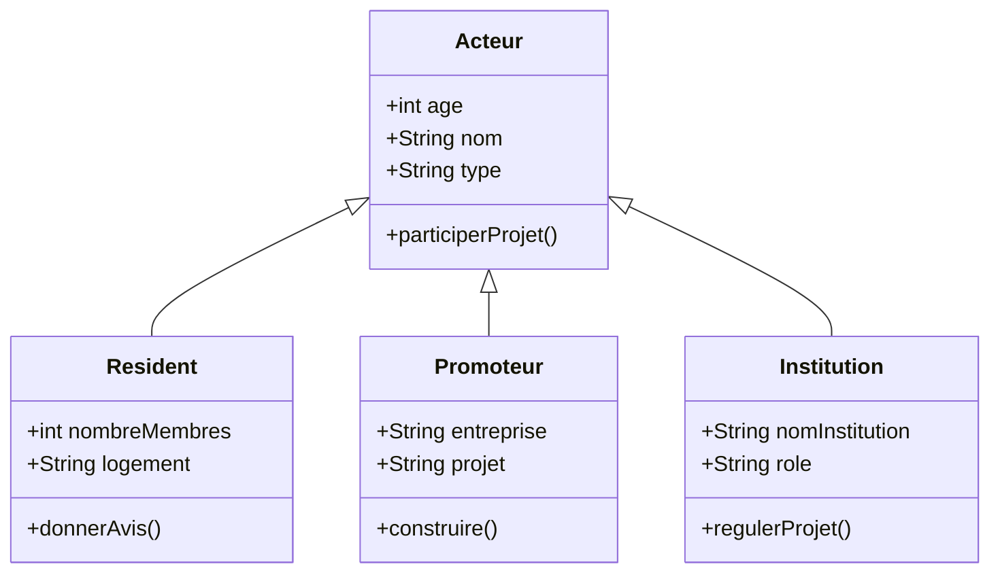

```mermaid

classDiagram
       Acteur <|-- Resident
    Acteur <|-- Promoteur
    Acteur <|-- Institution

    class Acteur {
        +int age
        +String nom
        +String type
        +participerProjet()
    }

       class Resident {
        
        +int nombreMembres
        +String logement
        +donnerAvis()
    }

    class Promoteur {
        +String entreprise
        +String projet
        +construire()
    }

    class Institution {
        +String nomInstitution
        +String role
        +regulerProjet()
    }

   

```
