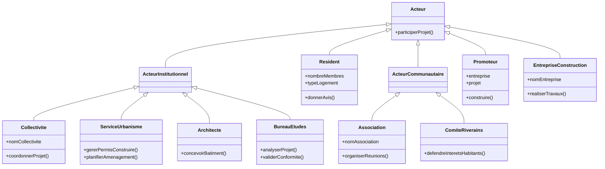

```mermaid

classDiagram

%% --- Classe mère ---
class Acteur {
    +participerProjet()
}

%% --- Catégories d'acteurs ---
Acteur <|-- ActeurInstitutionnel
Acteur <|-- Resident
Acteur <|-- ActeurCommunautaire

%% --- Acteurs institutionnels ---
ActeurInstitutionnel <|-- Collectivite
ActeurInstitutionnel <|-- ServiceUrbanisme
ActeurInstitutionnel <|-- Architecte
ActeurInstitutionnel <|-- BureauEtudes

%% --- Acteurs privés ---
Acteur <|-- Promoteur
Acteur <|-- EntrepriseConstruction

%% --- Acteurs communautaires ---
ActeurCommunautaire <|-- Association
ActeurCommunautaire <|-- ComiteRiverains

%% --- Détails des classes ---
class Resident {
    +nombreMembres
    +typeLogement
    +donnerAvis()
}

class Promoteur {
    +entreprise
    +projet
    +construire()
}

class EntrepriseConstruction {
    +nomEntreprise
    +realiserTravaux()
}

class Collectivite {
    +nomCollectivite
    +coordonnerProjet()
}

class ServiceUrbanisme {
    +gererPermisConstruire()
    +planifierAmenagement()
}

class Architecte {
    +concevoirBatiment()
}

class BureauEtudes {
    +analyserProjet()
    +validerConformite()
}

class Association {
    +nomAssociation
    +organiserReunions()
}

class ComiteRiverains {
    +defendreInteretsHabitants()
}

```
