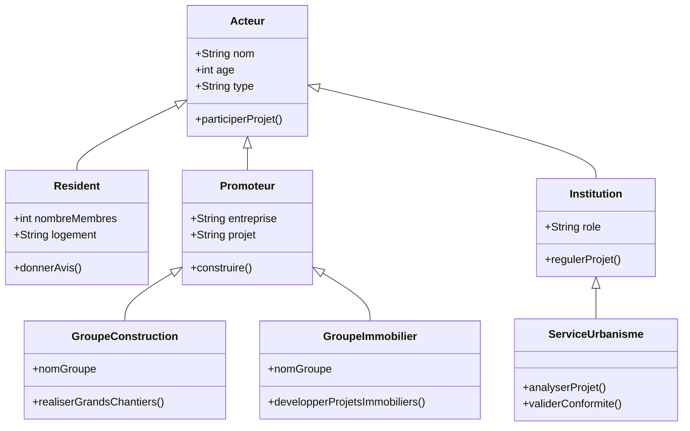

```mermaid

classDiagram
       
       class Acteur {
           +String nom
           +int age
           +String type
           +participerProjet()
       }

    
       Acteur <|-- Resident
       Acteur <|-- Promoteur
       Acteur <|-- Institution

       class Resident {
           +int nombreMembres
           +String logement
           +donnerAvis()
       }

     
       class Promoteur {
           +String entreprise
           +String projet
           +construire()
       }

      
       Promoteur <|-- GroupeConstruction
       Promoteur <|-- GroupeImmobilier

       class GroupeConstruction {
           +nomGroupe
           +realiserGrandsChantiers()
       }

       class GroupeImmobilier {
           +nomGroupe
           +developperProjetsImmobiliers()
       }

    
       class Institution {
           +String role
           +regulerProjet()
       }

      

       Institution <|-- ServiceUrbanisme

       
       class ServiceUrbanisme {
           +analyserProjet()
           +validerConformite()
       }


```
