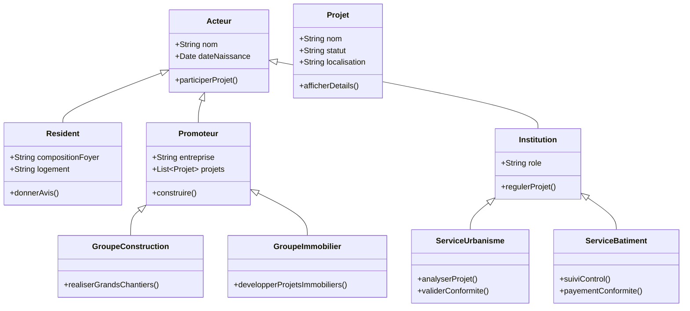

```mermaid
classDiagram
    class Acteur {
        +String nom
        +Date dateNaissance
        +participerProjet()
    }

    class Resident {
        +String compositionFoyer
        +String logement
        +donnerAvis()
    }

    class Promoteur {
        +String entreprise
        +List~Projet~ projets
        +construire()
    }

    class GroupeConstruction {
        +realiserGrandsChantiers()
    }

    class GroupeImmobilier {
        +developperProjetsImmobiliers()
    }

    class Institution {
        +String role
        +regulerProjet()
    }

    class ServiceUrbanisme {
        +analyserProjet()
        +validerConformite()
    }

    class ServiceBatiment {
        +suiviControl()
        +payementConformite()
    }

    class Projet {
        +String nom
        +String statut
        +String localisation
        +afficherDetails()
    }

  
    Acteur <|-- Resident
    Acteur <|-- Promoteur
    Acteur <|-- Institution
    Promoteur <|-- GroupeConstruction
    Promoteur <|-- GroupeImmobilier
    Institution <|-- ServiceUrbanisme
    Institution <|-- ServiceBatiment

```
