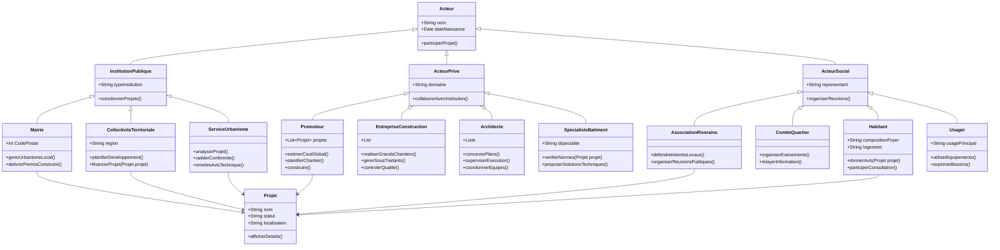

```mermaid
classDiagram
    %% Classe de base
    class Acteur {
        +String nom
        +Date dateNaissance
        +participerProjet()
    }

    %% Sous-classes principales d'acteurs
    class InstitutionPublique {
        +String typeInstitution
        +coordonnerProjets()
    }

    class ActeurPrive {
        +String domaine
        +collaborerAvecInstitution()
    }

    class ActeurSocial {
        +String representant
        +organiserReunions()
    }

    %% Institutions publiques
    class Mairie {
        +int CodePostal
        +gererUrbanismeLocal()
        +delivrerPermisConstruire()
    }

    class CollectiviteTerritoriale {
        +String region
        +planifierDeveloppement()
        +financerProjet(Projet projet)
    }

    class ServiceUrbanisme {
        +analyserProjet()
        +validerConformite()
        +emettreAvisTechnique()
    }

    %% Acteurs privés
    class Promoteur {
        
        +List~Projet~ projets
        +estimerCoutGlobal()
        +planifierChantier()
        +construire()
    }

    class EntrepriseConstruction {
        +List <employeurs>
        +realiserGrandsChantiers()
        +gererSousTraitants()
        +controlerQualite()
    }

    class Architecte {
        +Liste <numéroOrdre>
        +concevoirPlans()
        +superviserExecution()
        +coordonnerEquipes()
    }

    class SpecialisteBatiment {
        +String dspecialite
        +verifierNormes(Projet projet)
        +proposerSolutionsTechniques()
    }

    %% Acteurs sociaux
    class AssociationRiverains {

        +defendreInteretsLocaux()
        +organiserReunionsPubliques()
    }

    class ComiteQuartier {
        +organiserEvenements()
        +relayerInformation()
    }

    class Habitant {
        +String compositionFoyer
        +String logement
        +donnerAvis(Projet projet)
        +participerConsultation()
    }

    class Usager {
        +String usagePrincipal
        +utiliserEquipements()
        +exprimerBesoins()
    }

    %% Autres classes
    class Projet {
        +String nom
        +String statut
        +String localisation
        +afficherDetails()
    }

    %% Relations hiérarchiques
    Acteur <|-- InstitutionPublique
    Acteur <|-- ActeurPrive
    Acteur <|-- ActeurSocial

    InstitutionPublique <|-- Mairie
    InstitutionPublique <|-- CollectiviteTerritoriale
    InstitutionPublique <|-- ServiceUrbanisme

    ActeurPrive <|-- Promoteur
    ActeurPrive <|-- EntrepriseConstruction
    ActeurPrive <|-- Architecte
    ActeurPrive <|-- SpecialisteBatiment

    ActeurSocial <|-- AssociationRiverains
    ActeurSocial <|-- ComiteQuartier
    ActeurSocial <|-- Habitant
    ActeurSocial <|-- Usager

 Promoteur --> Projet 
    ServiceUrbanisme --> Projet 
    Mairie --> Projet 
    CollectiviteTerritoriale --> Projet 
    AssociationRiverains --> Projet 
    Habitant --> Projet
   
```
