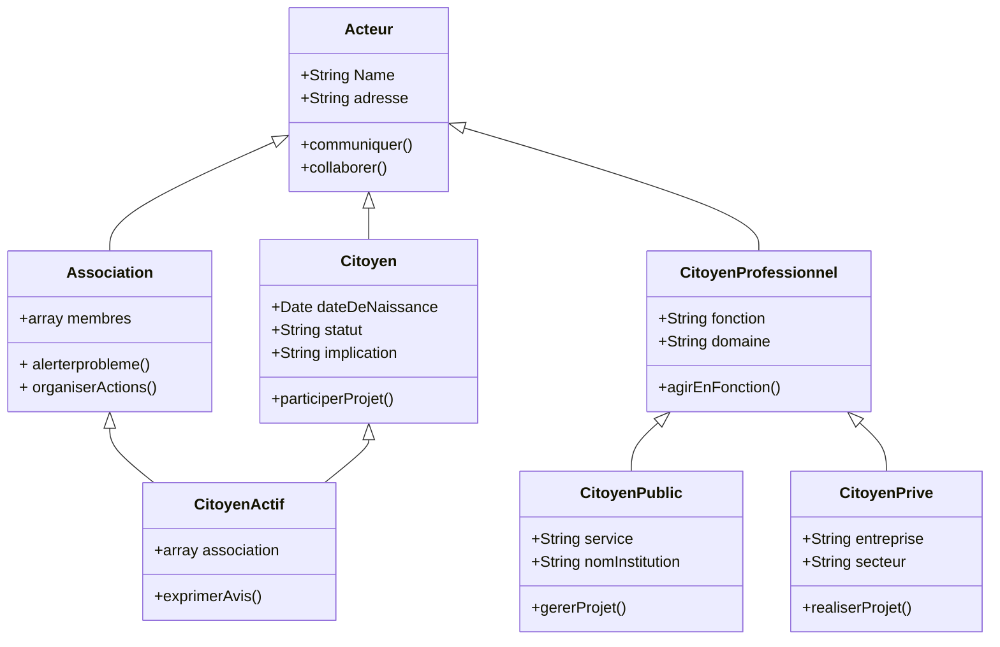

```mermaid
classDiagram
     
   Acteur <|-- Association
    Acteur <|-- Citoyen
     Association <|-- CitoyenActif
    Citoyen <|-- CitoyenActif
    Acteur <|-- CitoyenProfessionnel
    CitoyenProfessionnel <|-- CitoyenPublic
    CitoyenProfessionnel <|-- CitoyenPrive


    Acteur : +String Name
    Acteur : +String adresse
    Acteur: +communiquer()
    Acteur: +collaborer()


  class Citoyen {
     +Date   dateDeNaissance
     +String statut 
     +String implication
     +participerProjet()
  }

   class Association{

    +array membres 
    + alerterprobleme()
    + organiserActions()
    }
  class CitoyenActif {
     +array association
     +exprimerAvis()
  }

  class CitoyenProfessionnel {
     +String fonction
     +String domaine
     +agirEnFonction()
  }

  class CitoyenPublic {
     +String service
     +String nomInstitution
     +gererProjet()
  }

  class CitoyenPrive {
     +String entreprise
     +String secteur
     +realiserProjet()
  }
```
