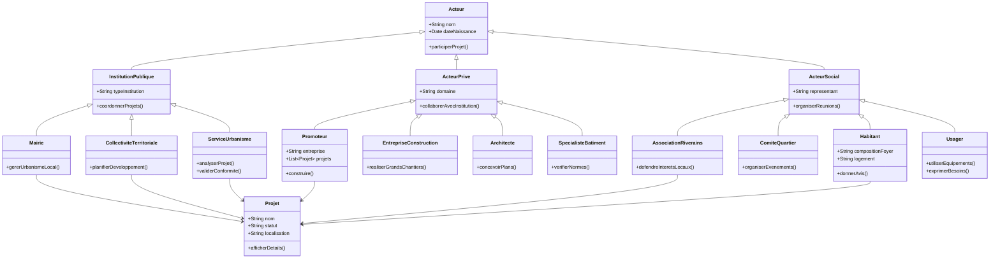

```mermaid
classDiagram
    %% Classe de base
    class Acteur {
        +String nom
        +Date dateNaissance
        +participerProjet()
    }

    %% Sous-classes principales d'acteurs
    class InstitutionPublique {
        +String typeInstitution
        +coordonnerProjets()
    }

    class ActeurPrive {
        +String domaine
        +collaborerAvecInstitution()
    }

    class ActeurSocial {
        +String representant
        +organiserReunions()
    }

    %% Institutions publiques
    class Mairie {
        +gererUrbanismeLocal()
    }

    class CollectiviteTerritoriale {
        +planifierDeveloppement()
    }

    class ServiceUrbanisme {
        +analyserProjet()
        +validerConformite()
    }

    %% Acteurs privés
    class Promoteur {
        +String entreprise
        +List~Projet~ projets
        +construire()
    }

    class EntrepriseConstruction {
        +realiserGrandsChantiers()
    }

    class Architecte {
        +concevoirPlans()
    }

    class SpecialisteBatiment {
        +verifierNormes()
    }

    %% Acteurs sociaux
    class AssociationRiverains {
        +defendreInteretsLocaux()
    }

    class ComiteQuartier {
        +organiserEvenements()
    }

    class Habitant {
        +String compositionFoyer
        +String logement
        +donnerAvis()
    }

    class Usager {
        +utiliserEquipements()
        +exprimerBesoins()
    }

    %% Autres classes
    class Projet {
        +String nom
        +String statut
        +String localisation
        +afficherDetails()
    }

    %% Relations hiérarchiques
    Acteur <|-- InstitutionPublique
    Acteur <|-- ActeurPrive
    Acteur <|-- ActeurSocial

    InstitutionPublique <|-- Mairie
    InstitutionPublique <|-- CollectiviteTerritoriale
    InstitutionPublique <|-- ServiceUrbanisme

    ActeurPrive <|-- Promoteur
    ActeurPrive <|-- EntrepriseConstruction
    ActeurPrive <|-- Architecte
    ActeurPrive <|-- SpecialisteBatiment

    ActeurSocial <|-- AssociationRiverains
    ActeurSocial <|-- ComiteQuartier
    ActeurSocial <|-- Habitant
    ActeurSocial <|-- Usager

 Promoteur --> Projet 
    ServiceUrbanisme --> Projet 
    Mairie --> Projet 
    CollectiviteTerritoriale --> Projet 
    AssociationRiverains --> Projet 
    Habitant --> Projet
   
```
