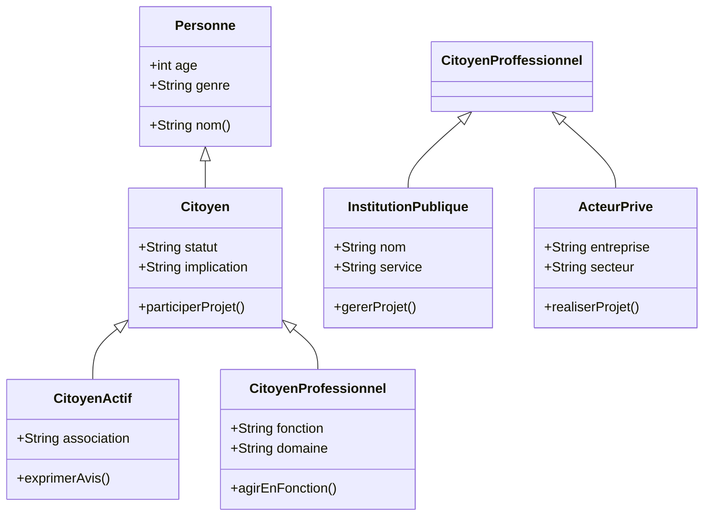

```mermaid
classDiagram
    Personne <|-- Citoyen
    Citoyen <|-- CitoyenActif
    Citoyen <|-- CitoyenProfessionnel
    CitoyenProffessionnel <|-- InstitutionPublique 
    CitoyenProffessionnel <|-- ActeurPrive 
   
  class Personne {
     +int age
     +String genre
     +String nom ()
    }

  class Citoyen {
     +String statut 
     +String implication
     +participerProjet()
    }
class CitoyenProfessionnel{
      +String fonction
      +String domaine
      +agirEnFonction()
      
     }
  class CitoyenActif{
          +String association
          +exprimerAvis()
          }
    
   class InstitutionPublique{
      +String nom
      +String service
      +gererProjet()
     }
   class ActeurPrive{
      +String entreprise
      +String secteur
      +realiserProjet()
     }
  
```
