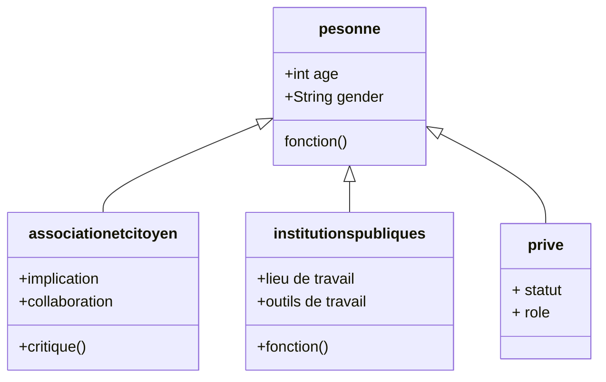

```mermaid
classDiagram
    pesonne <|-- associationetcitoyen
    pesonne <|-- institutions publiques
    pesonne <|-- prive

    pesonne : +int age
    pesonne : +String gender
    pesonne : fonction()

  class associationetcitoyen {
     +implication 
     +collaboration
     +critique ()
    }
    class institutions publiques{
          +lieu de travail
          +outils de travail
          +fonction ()
    }
    class prive{
      + statut
     +  role
     }
```
