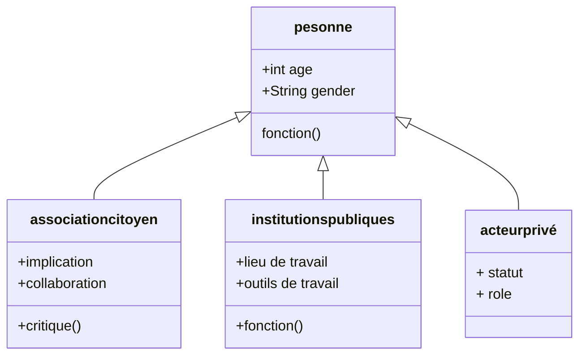

```mermaid
classDiagram
    pesonne <|-- association citoyen
    pesonne <|-- institutions publiques
    pesonne <|-- acteur privé 

    pesonne : +int age
    pesonne : +String gender
    pesonne : fonction()

  class association citoyen {
     +implication 
     +collaboration
     +critique ()
    }
    class institutions publiques{
          +lieu de travail
          +outils de travail
          +fonction ()
    }
    class acteur privé{
      + statut
     +  role
     }
```
