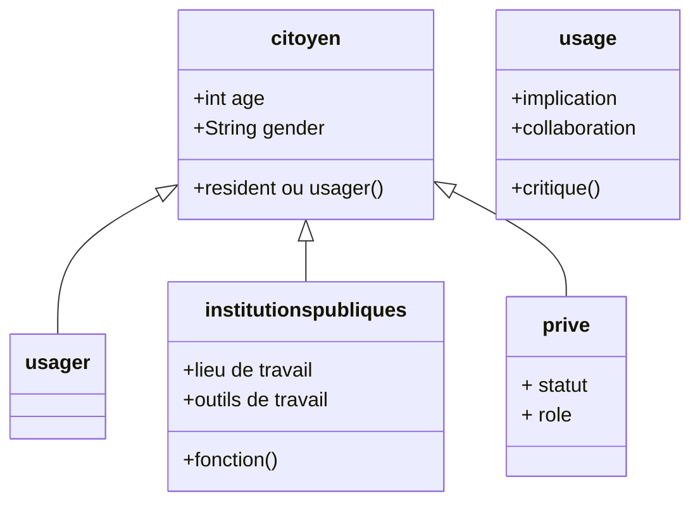

```mermaid
classDiagram
    citoyen <|-- usager
    citoyen <|-- institutions publiques
    citoyen <|-- prive

    citoyen : +int age
    citoyen : +String gender
    citoyen : +resident ou usager()

  class usage {
     +implication 
     +collaboration
     +critique ()
    }
    class institutions publiques{
          +lieu de travail
          +outils de travail
          +fonction ()
    }
    class prive{
      + statut
     +  role
     }
```
