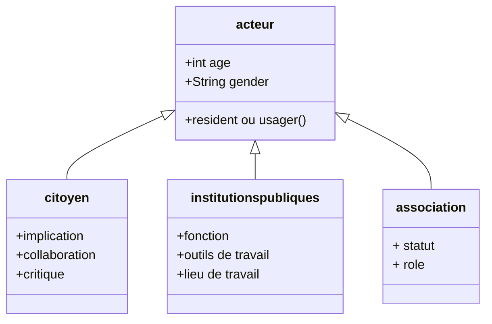

```mermaid
classDiagram
    acteur <|-- citoyen
    acteur <|-- institutions publiques
    acteur <|-- association

    acteur : +int age
    acteur : +String gender
    acteur: +resident ou usager()

  class citoyen{
     +implication 
     +collaboration
     +critique
    }
    class institutions publiques{
          +fonction
          +outils de travail
          +lieu de travail
    }
    class association{
      + statut
     +  role
     }
```
