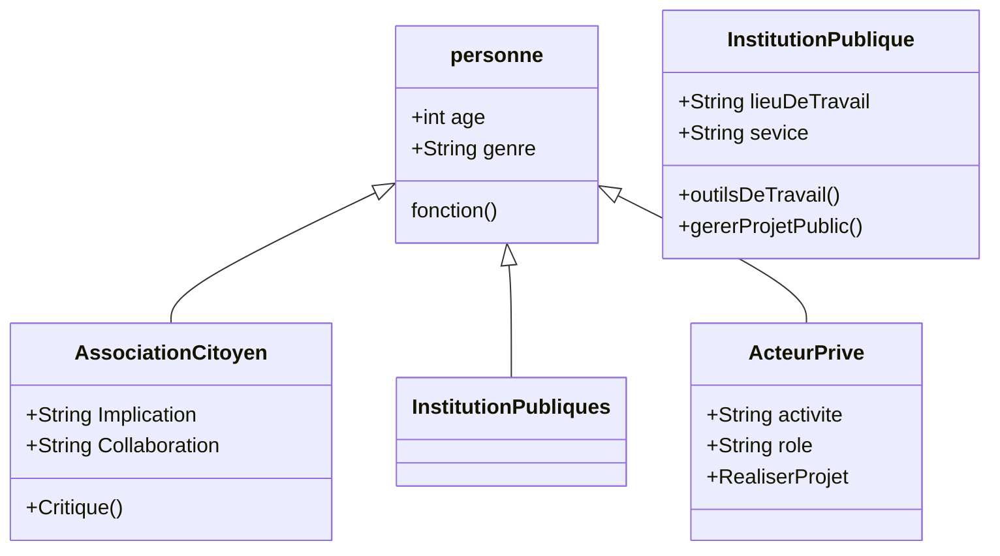

```mermaid
classDiagram
    personne <|-- AssociationCitoyen
    personne <|-- InstitutionPubliques
    personne <|-- ActeurPrive

    personne : +int age
    personne : +String genre
    personne : fonction()

  class AssociationCitoyen {
     +String Implication 
     +String Collaboration
     +Critique ()
    }
    class InstitutionPublique{
          +String lieuDeTravail
          +String sevice
          +outilsDeTravail()
          +gererProjetPublic()
    }
    class ActeurPrive{
      +String activite
      +String role
      +RealiserProjet
     }
```
