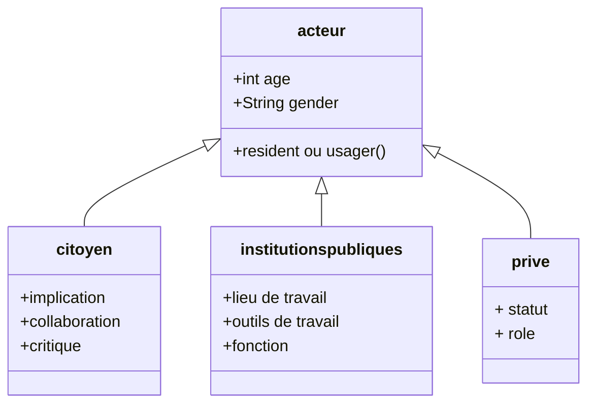

```mermaid
classDiagram
    acteur <|-- citoyen
    acteur <|-- institutions publiques
    acteur <|-- prive

    acteur : +int age
    acteur : +String gender
    acteur: +resident ou usager()

  class citoyen{
     +implication 
     +collaboration

     +critique
    }
    class institutions publiques{
          +lieu de travail
          +outils de travail

          +fonction
    }
    class prive{
      + statut
     +  role
     }
```
