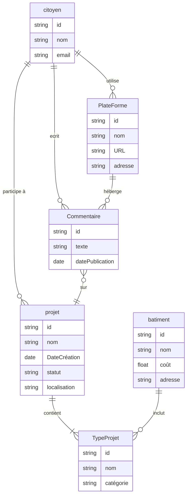

```mermaid
erDiagram
    citoyen ||--o{ projet : "participe à"
    projet ||--|{ TypeProjet : contient
    batiment ||--o{ TypeProjet : "inclut"
    citoyen ||--o{ Commentaire : "ecrit"
    Commentaire }o--|| projet : "sur"
    PlateForme ||--o{ Commentaire : "héberge"
    citoyen ||--o{ PlateForme : "utilise"

 citoyen {
        string id
        string nom
        string email
    }
    projet {
        string id
        string nom
        date DateCréation
        string statut
        string localisation
    }
    TypeProjet {
         string id
        string nom
        string catégorie
        }
    batiment {
        string id
        string nom
        float coût
        string adresse
    }
    PlateForme {
        string id
        string nom
        string URL
        string adresse
    }
  Commentaire {
        string id
        string texte
        date datePublication
    }
        
```
