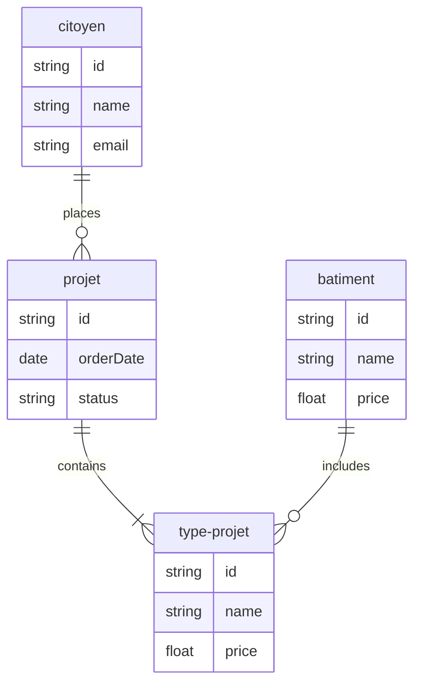

```mermaid
erDiagram
    citoyen ||--o{ projet : places
    projet ||--|{ type-projet : contains
    batiment ||--o{ type-projet : includes
    citoyen {
        string id
        string name
        string email
    }
    projet {
        string id
        date orderDate
        string status
    }
    batiment {
        string id
        string name
        float price
    }
    type-projet {
         string id
        string name
        float price
        }
        
```
