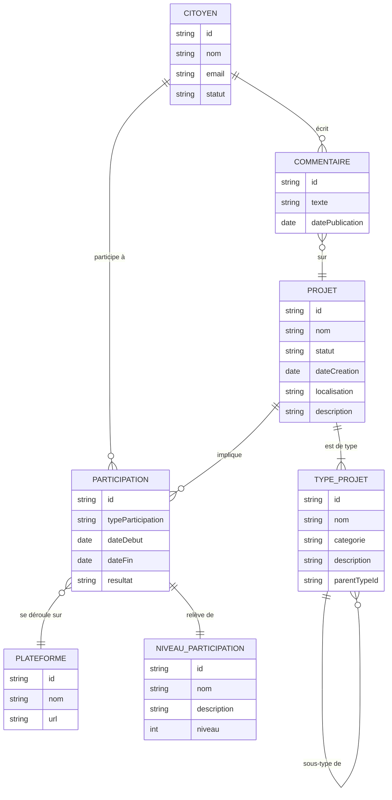

```mermaid
erDiagram
CITOYEN ||--o{ PARTICIPATION : "participe à"
    PROJET ||--o{ PARTICIPATION : "implique"
    PARTICIPATION }o--|| PLATEFORME : "se déroule sur"
    CITOYEN ||--o{ COMMENTAIRE : "écrit"
    COMMENTAIRE }o--|| PROJET : "sur"
    PROJET ||--|{ TYPE_PROJET : "est de type"
    TYPE_PROJET ||--o{ TYPE_PROJET : "sous-type de"
    PARTICIPATION ||--|| NIVEAU_PARTICIPATION : "relève de"

    CITOYEN {
        string id
        string nom
        string email
        string statut
    }

     PROJET {
        string id
        string nom
        string statut
        date dateCreation
        string localisation
        string description
    }
     TYPE_PROJET {
        string id
        string nom
        string categorie
        string description
        string parentTypeId
    }

     PLATEFORME {
        string id
        string nom
        string url
    }

    COMMENTAIRE {
        string id
        string texte
        date datePublication
    }

    PARTICIPATION {
        string id
        string typeParticipation
        date dateDebut
        date dateFin
        string resultat
    }
 NIVEAU_PARTICIPATION {
        string id
        string nom
        string description
        int niveau
    }
```
