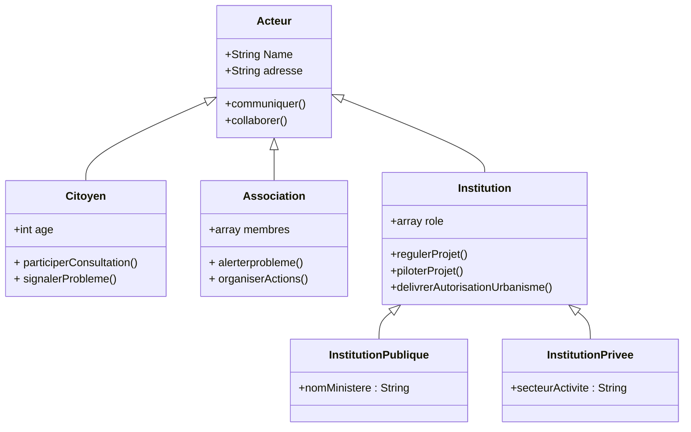

 ## 1. LES SOURCES DE DONNEES
- Données INSEE sur la population et le logement : https://www.insee.fr/fr/statistiques
- Données sur les équipements urbains : https://data.gouv.fr
- Territoire-de-projets-urbains : https://plaine-commune-developpement.fr
- Territoire du quartier de la plaine : https://fr.wikipedia.org/wiki/La_Plaine_Saint-Denis 
- Renouvellementurbain : https://odyssea-paris.com/renouvellement-urbain-plaine-saint-denis/
- Plainemémoire : https://plaine-memoirevivante.fr
- Permis de construire : https://www.data.gouv.fr/datasets/base-des-permis-de-construire-et-autres-autorisations-durbanisme 
- Projetsdamenagement : https://www.data.gouv.fr/datasets/projets-damenagement-dile-de-france/
- Projetsdamenagement : https://www.institutparisregion.fr/cartographies-interactives/tableau-de-bord-des-projets-damenagement/
- Projetsdamenagement : https://www.institutparisregion.fr/uploads/ExportData/projets_amenagement.html
- Projetsdamenagement : https://data.iledefrance.fr/explore/dataset/urbanisme-transitoire/export/?refine.departement=93&refine.commune=Saint-Denis 
- Projetsurbains : https://plainecommune.fr/projets/grands-projets-urbains/le-canal-saint-denis-reamenage/
- Reglementation : https://plainecommune.fr/revision-plui/
- Participationcitoyenne : https://www.saintdenis.fr/actualites/franc-moisin-zac-avis
- Amenagementurbain : https://www.saintdenis.fr/nouveau-coeur-ville
- Prandprojet : https://www.apur.org/fr/amenagement-urbain/quartier-gare/quartier-gare-saint-denis-pleyel
- Acteurimmobilier : https://www.apur.org/fr/amenagement-urbain/urbanisme-temporaire/acteurs-immobiliers 
- Grandparis : https://www.apur.org/fr/amenagement-urbain/quartier-gare/mutations-68-quartiers-gare-gpe-2021-projets-urbains-grand-paris
- Participationcitoyenne : https://www.apur.org/fr/population-societe/social-inclusion/solidarites-proximite-resilience-0 
- Le territoire : https://data.seinesaintdenis.fr/explore/?sort=-title 
- Association : https://ressources.seinesaintdenis.fr/Appel-a-projets-2024-en-faveur-des-habitants-des-quartiers-prioritaires-de-la
 ## 2. Data tables 

Les données brutes issues des sources précédentes ont été synthétisées dans le fichier Excel disponible  [ICI](https://github.com/kahiarchi/Les_acteurs_du_batiment_plaine_Saint_Denis/blob/main/DataTableDoudousml.xlsx)
 
 ### Table 1 - Acteures 
 | ID_Acteur | Nom                             | Adresse                                   |
| --------- | ------------------------------- | ----------------------------------------- |
| 1         | Sam Bentounsi                   | 12 rue du Landy, Saint-Denis              |
| 2         | Bruno Maguer                    | 4 avenue du Président Wilson, Saint-Denis |
| 3         | Association Union des Riverains | 28 rue du Port, Saint-Denis               |
| 4         | Mairie de Saint-Denis           | Place du Caquet, Saint-Denis              |
| 5         | Plaine Commune Développement    | 1 rue de la République, Saint-Denis       |
| 6         | Société Grand Paris Aménagement | 10 boulevard Ney, Paris 18e               |
| 7         | Claire Dupont                   | 25 rue Charles Michels, Saint-Denis       |
| 8         | Jean Martin                     | 7 boulevard Anatole France, Saint-Denis   |
| 9         | Élodie Moreau                   | 3 rue des Ursulines, Saint-Denis          |
| 10        | Paul Durand                     | 42 rue de la Justice, Saint-Denis         |

 ### Table 2 – citoyens
| ID_Citoyen | ID_Acteur | Âge |
| ---------- | --------- | --- |
| 1          | 1         | 30  |
| 2          | 2         | 50  |
| 3          | 7         | 40  |
| 4          | 8         | 35  |
| 5          | 9         | 27  |
| 6          | 10        | 45  |

###  Table 3 – associations
| ID_Association | ID_Acteur | Membres      |
| -------------- | --------- | ------------ |
| 1              | 3         | [1, 2, 7, 8] |
| 2              | 11        | [9, 10]      |

#### Exemple d'asociations dans la Seine-Saint-Denis :
1. Union des Riverains du Canal Saint-Denis
2. Collectif Quartier Gare Pleyel Citoyens

###  Table 4 – institutions

| ID_Institution | ID_Acteur | Rôles                                             |
| -------------- | --------- | ------------------------------------------------- |
| 1              | 4         | [“Aménagement urbain”, “Participation citoyenne”] |
| 2              | 5         | [“Planification”, “Suivi de projets”]             |
| 3              | 6         | [“Construction”, “Promotion immobilière”]         |

###  Table 5 – institutions_publiques

| ID_InstPublique | ID_Institution | Nom_Ministère                                   |
| --------------- | -------------- | ----------------------------------------------- |
| 1               | 1              | Mairie de Saint-Denis                           |
| 2               | 2              | Établissement Public Territorial Plaine Commune |

###  Table 6 – institutions_privees
| ID_InstPrivee | ID_Institution | Secteur_Activite          |
| ------------- | -------------- | ------------------------- |
| 1             | 3              | Immobilier et aménagement |

## 3. Diagramme de classe de mon projet 

Pour explorer ces données, nous utilisons les bibliothèques Python suivantes :

- **pandas** : pour la manipulation et la structuration des données tabulaires (import, nettoyage, filtrage, jointure, analyse).
- **matplotlib** : pour la création de visualisations graphiques (diagrammes en fromage, histogrammes, graphiques en barres).

### Diagramme en fromage Répartition des types d'acteurs

###  Histogramme des âges des citoyens

### Streamgraph : évolution temporelle des types d'acteurs

