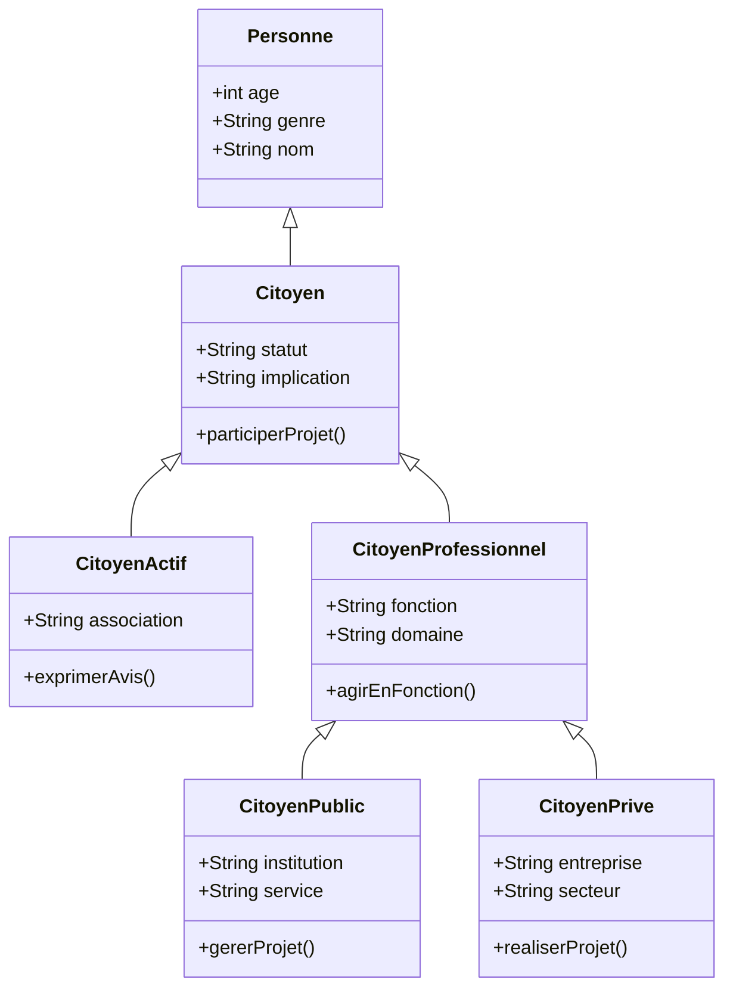

## 1_ LES SOURCES DE DONNEES 
- Données INSEE sur la population et le logement : https://www.insee.fr/fr/statistiques
- Données sur les équipements urbains : https://data.gouv.fr
- Territoire-de-projets-urbains : https://plaine-commune-developpement.fr
- Territoire du quartier de la plaine : https://fr.wikipedia.org/wiki/La_Plaine_Saint-Denis 
- Renouvellementurbain : https://odyssea-paris.com/renouvellement-urbain-plaine-saint-denis/
- Plainemémoire : https://plaine-memoirevivante.fr
- Permis de construire : https://www.data.gouv.fr/datasets/base-des-permis-de-construire-et-autres-autorisations-durbanisme 
- Projetsdamenagement : https://www.data.gouv.fr/datasets/projets-damenagement-dile-de-france/
- Projetsdamenagement : https://www.institutparisregion.fr/cartographies-interactives/tableau-de-bord-des-projets-damenagement/
- Projetsdamenagement : https://www.institutparisregion.fr/uploads/ExportData/projets_amenagement.html
- Projetsdamenagement : https://data.iledefrance.fr/explore/dataset/urbanisme-transitoire/export/?refine.departement=93&refine.commune=Saint-Denis 
- Projetsurbains : https://plainecommune.fr/projets/grands-projets-urbains/le-canal-saint-denis-reamenage/
- Reglementation : https://plainecommune.fr/revision-plui/
- Participationcitoyenne : https://www.saintdenis.fr/actualites/franc-moisin-zac-avis
- Amenagementurbain : https://www.saintdenis.fr/nouveau-coeur-ville
- Prandprojet : https://www.apur.org/fr/amenagement-urbain/quartier-gare/quartier-gare-saint-denis-pleyel
- Acteurimmobilier : https://www.apur.org/fr/amenagement-urbain/urbanisme-temporaire/acteurs-immobiliers 
- Grandparis : https://www.apur.org/fr/amenagement-urbain/quartier-gare/mutations-68-quartiers-gare-gpe-2021-projets-urbains-grand-paris
- Participationcitoyenne : https://www.apur.org/fr/population-societe/social-inclusion/solidarites-proximite-resilience-0 
- Le territoire : https://data.seinesaintdenis.fr/explore/?sort=-title 
- Association : https://ressources.seinesaintdenis.fr/Appel-a-projets-2024-en-faveur-des-habitants-des-quartiers-prioritaires-de-la
 ## 2_ LE LIEN DATA TABLES ( xlsx)
[data_table.xlsx](https://github.com/user-attachments/files/23320020/data_table.xlsx)
## 3_ DATA TABLES
### - Table 01 - persone
| ID | Nom | Âge | Genre |
|----|-----|-----|-------|
| 1  | Sam Bentounsi | 30 | M |
| 2  | Bruno Maguer | 50 | M |
| 3  | Association Union des Riverains | 1 | F |
| 4  | Claire Dupont | 40 | F |
| 5  | Jean Martin | 35 | M |
| 6  | Sophie Leroy | 28 | F |
| 7  | Paul Durand | 45 | M |
| 8  | Marie Dubois | 32 | F |
| 9  | Antoine Bernard | 38 | M |
| 10 | Élodie Moreau | 27 | F |
### - Table 02 - citoyen 
| ID | Statut / Rôle | Description / Fonction | Référence |
|----|----------------|------------------------|------------|
| 1  | Habitant | Nouveau propriétaire en BRS – résidence Les Météores | 1.1 |
| 2  | Professionnel | Président de réseau d’entreprises territoriales | 2 |
| 3  | Actif associatif | Membre du comité de riverains Stade de France | 3 |
| 4  | Habitant | Locataire à Plaine Commune | 4 |
| 5  | Professionnel | Architecte urbaniste | 5 |
| 6  | Actif associatif | Président d’association locale | 6 |
| 7  | Habitant | Propriétaire d’un appartement | 7 |
| 8  | Professionnel | Directeur d’entreprise immobilière | 8 |
| 9  | Actif associatif | Membre d’association citoyenne | 9 |
| 10 | Habitant | Résident du quartier des Mureaux | 10 |
### - Table 03 - citoyenActif 
| ID | Nom de l’association / collectif | Référence Citoyen |
|----|----------------------------------|-------------------|
| 1  | Comité Vigilance Plaine          | 3 |
| 2  | Association Plaine Citoyenne     | 6 |
| 3  | Réseau des habitants             | 9 |
### - Table 04 - citoyenProfessionnel
| ID | Fonction | Domaine | Référence Citoyen |
|----|-----------|----------|-------------------|
| 1  | Dirigeant | Développement territorial | 2 |
| 2  | Architecte | Urbanisme | 5 |
| 3  | Directeur | Immobilier | 8 |
### - Table 05 - institutionPublique
| ID | Nom de l’institution | Service / Domaine | Référence CitoyenProfessionnel |
|----|-----------------------|-------------------|--------------------------------|
| 1  | Plaine Commune Développement | Aménagement urbain | 1.1 |
| 2  | Mairie de Saint-Denis | Urbanisme | 2 |
| 3  | Service Habitat Plaine | Logement | 3 |
### - Table 06 - acteurPrive
| ID | Nom de l'acteur                  | Secteur d'activité             | Catégorie |
|----|---------------------------------|-------------------------------|----------|
| 1  | WO2 - Immobilier Bas Carbone     | Construction & bureau          | 1.1      |
| 2  | Sogeprom                         | Immobilier résidentiel         | 2        |
| 3  | Bouygues Construction            | Grands projets urbains         | 3        |
### - Table 07 - projet
| ID  | Nom du projet                          | Statut     | Localisation           |
|-----|---------------------------------------|-----------|-----------------------|
| 2   | Projet Bois Bas Carbone - Pôle siège GRDF | En cours  | La Plaine Saint-Denis |
| 3   | Quartier du Canal                      | Planifié  | La Plaine Saint-Denis |
| 4   | Réhabilitation Stade de France         | En cours  | La Plaine Saint-Denis |
| 5   | ZAC Franc Moisin                        | Achevé    | La Plaine Saint-Denis |
| 6   | Projet Pleyel                           | En cours  | La Plaine Saint-Denis |
| 7   | Réaménagement gare Saint-Denis         | Planifié  | La Plaine Saint-Denis |
| 8   | Extension ZAC Mairie                    | En cours  | La Plaine Saint-Denis |
| 9   | Résidence sociale La Plaine            | Achevé    | La Plaine Saint-Denis |
| 10  | Parc urbain Canal Saint-Denis          | Planifié  | La Plaine Saint-Denis |
### - Table 08 - participation 
| ID  | ID Projet | ID Acteur | Rôle                     |
|-----|-----------|-----------|--------------------------|
| 1   | 3         | 1.1       | Membre comité            |
| 2   | 2         | 2         | Promoteur entreprise     |
| 3   | 6         | 3         | Membre association       |
| 4   | 9         | 4         | Consultant citoyen       |
| 5   | 1         | 5         | Résident participant     |
| 6   | 4         | 6         | Habitant suivi           |
| 7   | 7         | 7         | Propriétaire suivi       |
| 8   | 5         | 8         | Professionnel partenaire |
| 9   | 8         | 9         | Promoteur                |
| 10  | 10        | 10        | Habitant observateur     |
### - Table 09 - Realisation
| ID  | ID Acteur 1 | ID Acteur 2 | ID Rôle | Type d'intervention         |
|-----|------------|------------|---------|----------------------------|
| 1   | 1.1        | \N         | 1.2     | Maître d’ouvrage           |
| 2   | \N         | 1          | 2       | Construction spécialisée bois |
| 3   | 2          | \N         | 3       | Supervision                |
| 4   | \N         | 2          | 4       | Construction résidentielle |
| 5   | 3          | \N         | 5       | Pilotage                   |
| 6   | \N         | 3          | 6       | Construction bureaux       |
| 7   | 1          | \N         | 7       | Maîtrise d’ouvrage         |
| 8   | \N         | 2          | 8       | Construction immobilière   |
| 9   | 2          | \N         | 9       | Suivi                       |
| 10  | \N         | 3          | 10      | Aménagement espaces        |
## 4_ STRUCTURE VISUELLE 
Le diagramme suivant montre les relations entre les différents acteurs du projet .

## 5_ REPRESENTATIONS ET ANALYSE DES DONNEES 

Cette étude analyse la participation de la population, des acteurs publics et privés dans plusieurs projets urbains de La Plaine Saint-Denis. Les représentations suivantes permettent de se renseigner sur la répartition des acteurs, le type de participation et la localisation des projets. Pour étudier la participation citoyenne sur les projets urbains du quartier de la plaine Saint Denis, nous avons pensé aux représentations suivantes :
- **Histogramme** pour effectuer la comparaison entre le nombre de citoyens en fonction de leur statut (habitant, professionnel, actif associatif)
- 
- **Camembert** pour montrer la proportion de chaque acteur ( public , privé et citoyen )
- 
- **Carte interactive** pour localiser les projets participatifs dans le quartier ou la ville .
- 
- **Graphique en barres empilées** pour visualiser la participation selon les types de projets ( culturels , educatifs , sportifs , détentes.....)
-

** OBSERVATIONS :**
###  Nombre de citoyens par statut
  -  Les habitants sont minoritaires parmi les citoyens par rapport aux professionnels et aux acteurs associatifs. 

###  Répartition des acteurs (citoyens, publics, privés)
  - Les citoyens constituent la plus grande part des acteurs.
  - Les acteurs publics et privés s’ajustent en apportant un soutien institutionnel et économique aux projets.
    
### Participation par type de projet et type d’acteur
  - La participation citoyenne se concentre sur les projets culturels et éducatifs.
  - Les professionnels apparaissent surtout dans les projets économiques ou d’infrastructure.
  - Les acteurs associatifs sont présents sur les projets citoyens et communautaires.
    
### Localisation des projets participatifs à La Plaine Saint-Denis
  - Les projets sont concentrés dans le centre de La Plaine Saint-Denis.
  - Cette localisation montre où la participation citoyenne est la plus forte et met en évidence des zones moins couvertes.
  
## 6_ INTERACTIONS AVEC L'ENVIRONNEMENT 
 La localisation des projets participatifs est exécutée en fonction de la proximité des résidents et des services publics, afin de faciliter l’adhésion des habitants. C’est aussi le cas des projets culturels et éducatifs qui peuvent favoriser l’interaction sociale et environnementale dans le quartier et renforcer les dynamiques locales. La répartition spatiale de l’ensemble de ces projets montre ainsi comment l'engagement citoyen influence l’aménagement urbain, en programmant les actions en établissements des priorités des acteurs du territoire.
## 7_ Conclusion
 Les habitants apparaissent comme les principaux participants, ce qui confirme l’importance de la mobilisation locale dans la dynamique du quartier. Les acteurs publics et privés jouent un rôle structurant et complémentaire en soutenant les initiatives. Par ailleurs, les projets culturels et éducatifs se montrent de nature à susciter un engagement citoyen plus marqué que la rééducation par exemple. Enfin, l’implantation territoriale des projets met en évidence des territoires à participation forte et d’autres où il convient de progresser, de manière à obtenir une couverture du territoire plus équilibrée.
