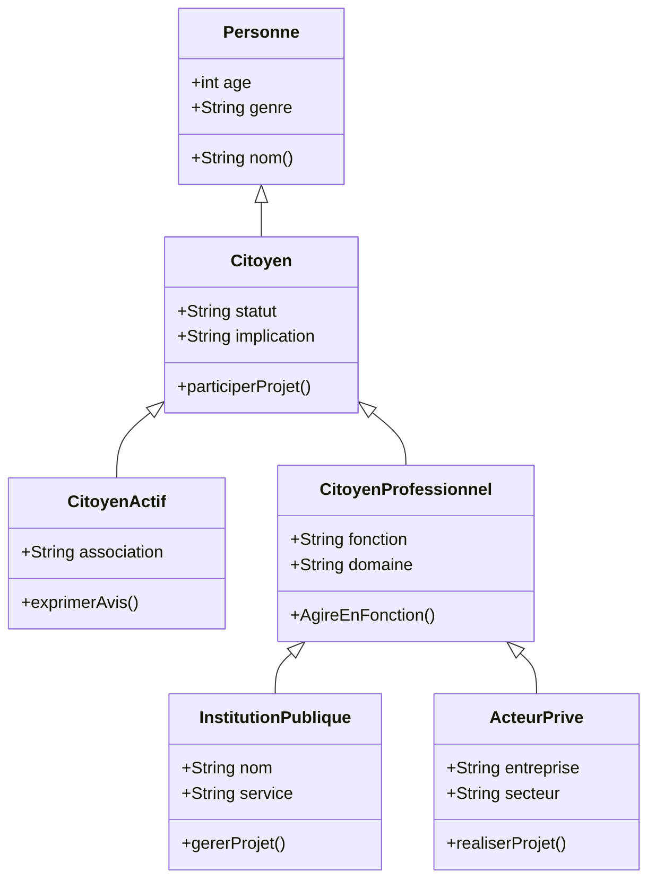
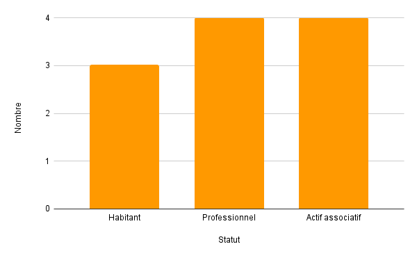
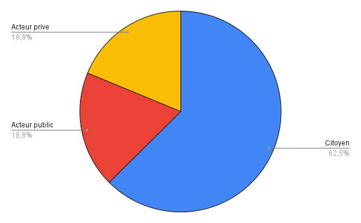
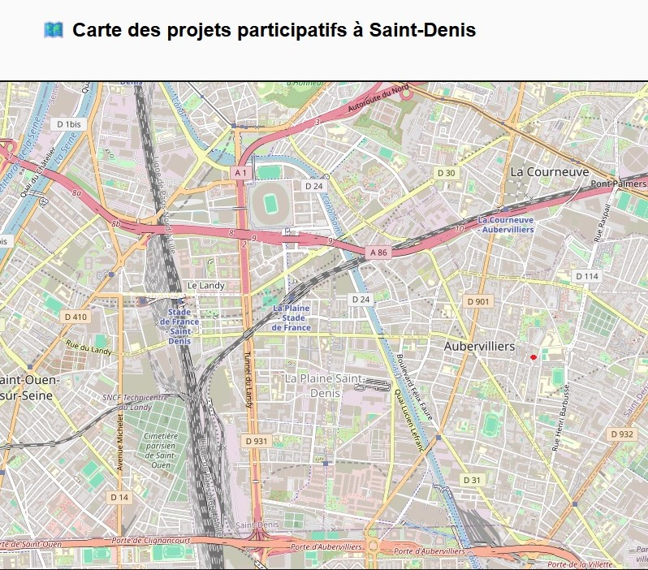
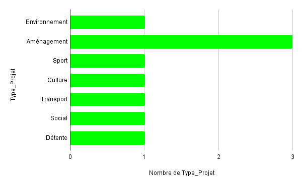

## 1_ LES SOURCES DE DONNEES 
Données INSEE sur la population et le logement : https://www.insee.fr/fr/statistiques
- Données sur les équipements urbains : https://data.gouv.fr
- Observation des projets urbains à Saint-Denis (notes personnelles et photos)
- Base de données sur les projets participatifs : https://www.diigo.com/user/luckysemiosis?query=%23ACEHN+%23statistiques
- Territoire-de-projets-urbains : https://plaine-commune-developpement.fr
- Territoire du quartier de la plaine : https://fr.wikipedia.org/wiki/La_Plaine_Saint-Denis 
- Renouvellementurbain : https://odyssea-paris.com/renouvellement-urbain-plaine-saint-denis/
- Plainemémoire : https://plaine-memoirevivante.fr
- Permis de construire : https://www.data.gouv.fr/datasets/base-des-permis-de-construire-et-autres-autorisations-durbanisme 
- Projetsdamenagement : https://www.data.gouv.fr/datasets/projets-damenagement-dile-de-france/
- Projetsdamenagement : https://www.institutparisregion.fr/cartographies-interactives/tableau-de-bord-des-projets-damenagement/
- Projetsdamenagement : https://www.institutparisregion.fr/uploads/ExportData/projets_amenagement.html
- Projetsdamenagement : https://data.iledefrance.fr/explore/dataset/urbanisme-transitoire/export/?refine.departement=93&refine.commune=Saint-Denis 
- Projetsurbains : https://plainecommune.fr/projets/grands-projets-urbains/le-canal-saint-denis-reamenage/
- Reglementation : https://plainecommune.fr/revision-plui/
- Participationcitoyenne : https://www.saintdenis.fr/actualites/franc-moisin-zac-avis
- Amenagementurbain : https://www.saintdenis.fr/nouveau-coeur-ville
- Prandprojet : https://www.apur.org/fr/amenagement-urbain/quartier-gare/quartier-gare-saint-denis-pleyel
- Acteurimmobilier : https://www.apur.org/fr/amenagement-urbain/urbanisme-temporaire/acteurs-immobiliers 
- Grandparis : https://www.apur.org/fr/amenagement-urbain/quartier-gare/mutations-68-quartiers-gare-gpe-2021-projets-urbains-grand-paris
- Participationcitoyenne : https://www.apur.org/fr/population-societe/social-inclusion/solidarites-proximite-resilience-0 
- Le territoire : https://data.seinesaintdenis.fr/explore/?sort=-title 
- Association : https://ressources.seinesaintdenis.fr/Appel-a-projets-2024-en-faveur-des-habitants-des-quartiers-prioritaires-de-la
 ## 2_ LE LIEN DATA TABLES ( xlsx)

## 3_ DATA TABLES

Table Acteur

Table Résident :

Table Promoteur :

Table GroupeConstruction :

Table GroupeImmobilier :

Table Institution :

Table ServiceUrbanisme : 

Table ServiceBatiment : 

## 4_ STRUCTURE VISUELLE 
Le diagramme suivant montre les relations entre les différents acteurs du projet .

## 5_ REPRESENTATIONS ET ANALYSE DES DONNEES 

Cette étude analyse la participation des citoyens, des acteurs publics et privés dans différents projets urbains à La Plaine Saint-Denis. Les visualisations suivantes permettent de comprendre la répartition des acteurs, le type de participation et la localisation des projets.

Afin d'analyser la participation citoyenne dans les projets urbains au quartier de la plaine Saint Denis , nous avons envisagé les représentations suivantes  :
- **Histogramme** pour comparer le nombre de citoyens selon leur statut ( habitant , professionnel , actif associatif )
- 
- **Camembert** pour montrer la proportion de chaque acteur ( public , privé et citoyen )
- 
- **Carte interactive** pour localiser les projets participatifs dans le quartier ou la ville .
- 
- **Graphique en barres empilées** pour visualiser la participation selon les types de projets ( culturels , educatifs , sportifs , détentes.....)
-

** OBSERVATIONS :**

###  Nombre de citoyens par statut
**Observation **
- Les habitants représentent la majorité des participants.
- Les professionnels et acteurs associatifs sont également présents, mais en plus faible proportion.
###  Répartition des acteurs (citoyens, publics, privés)

**Observation **
- Les citoyens constituent la plus grande part des acteurs.
- Les acteurs publics et privés sont équilibrés, apportant un soutien institutionnel et économique aux projets.
### Participation par type de projet et type d’acteur
**Observation **

- Les projets culturels et éducatifs attirent le plus de participation citoyenne.
- Les professionnels interviennent surtout dans les projets économiques ou d’infrastructure.
- Les acteurs associatifs sont engagés dans des projets citoyens et communautaires.
### Localisation des projets participatifs à La Plaine Saint-Denis
*Observation **
- Les projets sont concentrés dans le centre de La Plaine Saint-Denis.
- Cette localisation montre où la participation citoyenne est la plus forte et met en évidence des zones moins couvertes.
## 6_ INTERACTIONS AVEC L'ENVIRONNEMENT 
- Les projets participatifs se situent près des zones résidentielles et services publics, ce qui facilite la mobilisation des habitants.  
- Les projets culturels et éducatifs créent des points d’interaction sociale et environnementale dans le quartier.  
- La répartition spatiale des projets montre comment l’engagement citoyen influence directement l’aménagement urbain.
## 7_ Conclusion
- Les habitants sont les principaux participants, confirmant l’importance de la mobilisation locale.  
- Les acteurs publics et privés apportent un soutien structurant et complémentaire.  
- Les projets culturels et éducatifs génèrent le plus d’engagement citoyen.  
- La localisation des projets met en évidence des zones à forte participation et d’autres à renforcer pour une couverture territoriale optimale.

## 6_ INTERACTIONS ENTRE LES TABLES ET L'ENVIRONNEMENT 
Les différentes tables représentent les acteurs et les dynamiques de participation citoyenne à la plaine commune  dont le quartier de la plaine fait partie .
- La **table personne** constitue la base du modèle chaque individu est identifié par son age , son genre et son nom . 
- La **table citoyen** relie ces personnes à un **statut social ou professionnel** indiquant leur niveau d'implication dans la vie locale . 
- Les tables **citoyenActif** et **citoyenProfessionnel** précisent les rôles spécifiques associatifs ou institutionnels des citoyens engagés .
- Les tables **institutionsPubliques** et **acteursPrivés** interviennent dans la réalisation des projets **table projets** qui sont à leur tour liés a la **table participation** illustrant la collaboration habitants , associations et structures professionnels . 
- La **table Réalisation** complète le modèle en suivant l'état d'avancement des projets .  

