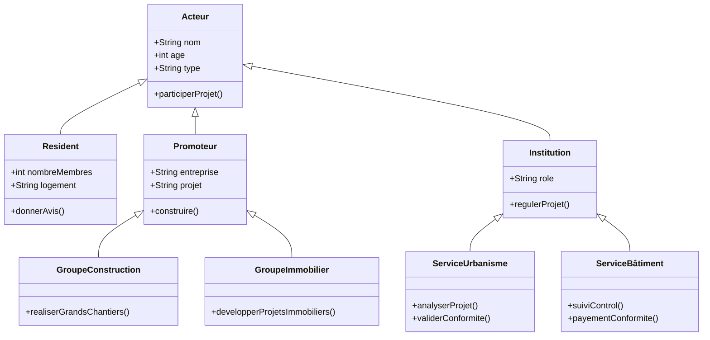

## 1_ LES SOURCES DE DONNEES 
Données INSEE sur la population et le logement : https://www.insee.fr/fr/statistiques
- Données sur les équipements urbains : https://data.gouv.fr
- Territoire-de-projets-urbains : https://plaine-commune-developpement.fr
- Territoire du quartier de la plaine : https://fr.wikipedia.org/wiki/La_Plaine_Saint-Denis 
- Renouvellementurbain : https://odyssea-paris.com/renouvellement-urbain-plaine-saint-denis/
- Plainemémoire : https://plaine-memoirevivante.fr
- Permis de construire : https://www.data.gouv.fr/datasets/base-des-permis-de-construire-et-autres-autorisations-durbanisme 
- Projetsdamenagement : https://www.data.gouv.fr/datasets/projets-damenagement-dile-de-france/
- Projetsdamenagement : https://www.institutparisregion.fr/cartographies-interactives/tableau-de-bord-des-projets-damenagement/
- Projetsdamenagement : https://www.institutparisregion.fr/uploads/ExportData/projets_amenagement.html
- Projetsdamenagement : https://data.iledefrance.fr/explore/dataset/urbanisme-transitoire/export/?refine.departement=93&refine.commune=Saint-Denis 
- Projetsurbains : https://plainecommune.fr/projets/grands-projets-urbains/le-canal-saint-denis-reamenage/
- Reglementation : https://plainecommune.fr/revision-plui/
- Participationcitoyenne : https://www.saintdenis.fr/actualites/franc-moisin-zac-avis
- Amenagementurbain : https://www.saintdenis.fr/nouveau-coeur-ville
- Prandprojet : https://www.apur.org/fr/amenagement-urbain/quartier-gare/quartier-gare-saint-denis-pleyel
- Acteurimmobilier : https://www.apur.org/fr/amenagement-urbain/urbanisme-temporaire/acteurs-immobiliers 
- Grandparis : https://www.apur.org/fr/amenagement-urbain/quartier-gare/mutations-68-quartiers-gare-gpe-2021-projets-urbains-grand-paris
- Participationcitoyenne : https://www.apur.org/fr/population-societe/social-inclusion/solidarites-proximite-resilience-0 
- Le territoire : https://data.seinesaintdenis.fr/explore/?sort=-title 
- Association : https://ressources.seinesaintdenis.fr/Appel-a-projets-2024-en-faveur-des-habitants-des-quartiers-prioritaires-de-la
  
 ## 2_ LE LIEN DATA TABLES ( xlsx)

## 3_ DATA TABLES

Table Acteur

Table Résident :

Table Promoteur :

Table GroupeConstruction :

Table GroupeImmobilier :

Table Institution :

Table ServiceUrbanisme : 

Table ServiceBatiment : 

## 4_ STRUCTURE VISUELLE 

Le diagramme suivant montre les relations entre les différents acteurs du projet .

## 5_ REPRESENTATIONS ET ANALYSE DES DONNEES 

L’analyse des données a pour objectif de mieux comprendre la répartition et les interactions entre les différents acteurs du projet urbain.
Les informations issues des tables permettent de visualiser les relations entre résidents, promoteurs et institutions, ainsi que la progression des projets dans la zone étudiée.
Les représentations graphiques et cartographiques facilitent cette lecture en mettant en évidence les tendances, les types de collaboration et la localisation des projets.

Afin d'analyser la participation citoyenne dans les projets urbains au quartier de la plaine Saint Denis , nous avons envisagé les représentations suivantes  :
- **Histogramme**  présente la répartition du nombre d’acteurs selon leur type.
Chaque barre représente une catégorie d’acteurs : résidents, promoteurs ou institutions.
Ce graphique permet de visualiser rapidement quels types d’acteurs sont les plus représentés dans le projet et de comprendre la diversité des participants impliqués dans le processus urbain.
- 

- **Camembert** illustre la proportion de projets selon leur statut. Chaque part montre la part de projets « En cours », « Achevés » ou « Planifiés ».
- (
)
- **Carte interactive** pour localiser les projets participatifs dans le quartier ou la ville .
- 

- **Graphique en barres empilées** montre les collaborations des promoteurs avec les institutions. Les couleurs représentent les différents types de collaboration.
-

** OBSERVATIONS :**

Les données montrent une répartition équilibrée entre les projets planifiés, en construction et terminés.
Les collaborations entre promoteurs et institutions mettent en évidence une bonne coordination entre les acteurs techniques et administratifs.
Les échanges entre résidents et services illustrent une volonté d’intégrer la population au processus de suivi et d’évaluation des projets.

## 6_ INTERACTIONS AVEC L'ENVIRONNEMENT 
La localisation des projets à la Plaine Saint-Denis révèle une forte concentration dans un même secteur urbain.
Cette proximité facilite la gestion des chantiers, la mutualisation des équipements et la cohérence du développement local.
Les projets participatifs contribuent ainsi à renforcer les liens entre les habitants et leur cadre de vie, tout en soutenant un urbanisme plus collaboratif.
## 7_ Conclusion
L’ensemble des données met en valeur la collaboration entre les différents acteurs et l’importance de leur rôle dans le développement urbain.
Cette dynamique participative favorise un environnement mieux organisé, durable et adapté aux besoins des résidents.
