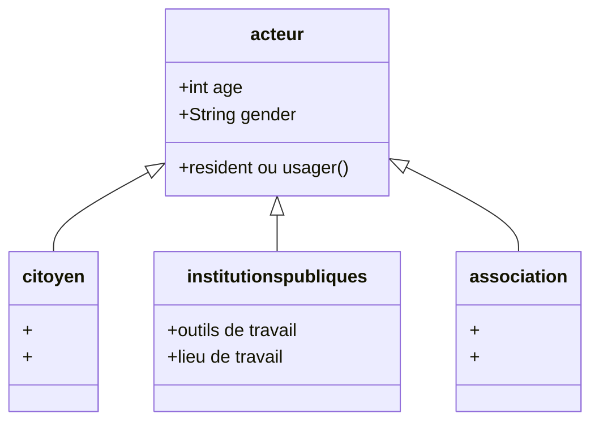

```mermaid
classDiagram
    acteur <|-- citoyen
    acteur <|-- institutions publiques
    acteur <|-- association

    acteur : +int age
    acteur : +String gender
    acteur: +resident ou usager()

  class citoyen{
      +
     +
    }
    class institutions publiques{
      +outils de travail
     +lieu de travail
    }
    class association{
      +
     +
  
     }
```
