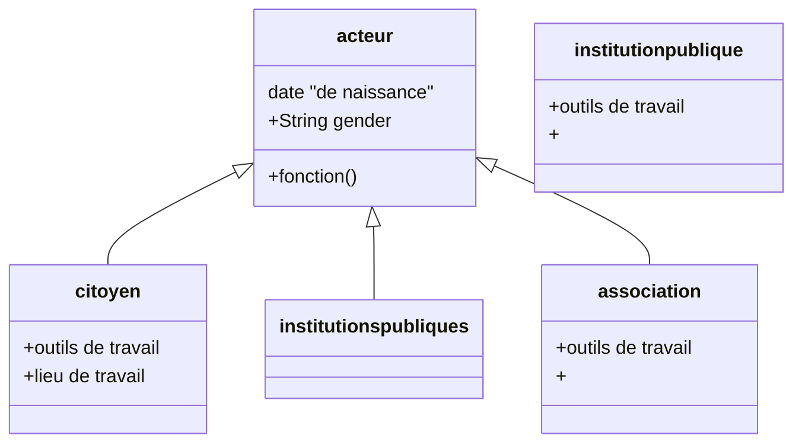

```mermaid
classDiagram
   acteur <|-- citoyen
   acteur <|-- institutions publiques 
   acteur <|-- association

   acteur : date "de naissance"
   acteur : +String gender
   acteur: +fonction()
  

   class citoyen{
     +outils de travail
     +lieu de travail
     }
    class institution publique{
     +outils de travail
     +
     }
 class association{
     +outils de travail
     +
     }
```
